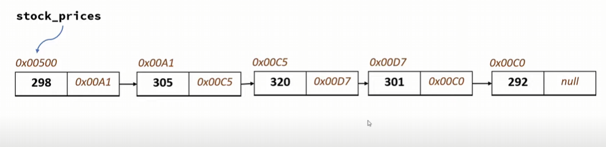
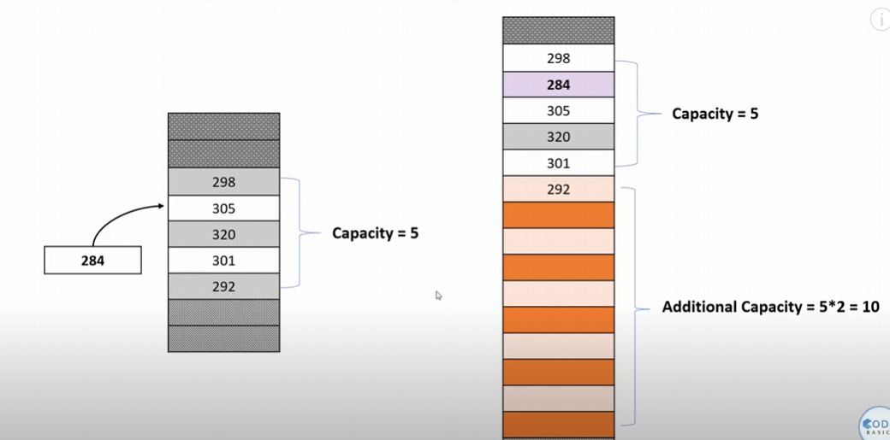

# Linked List

- Linked List is a data structure that basically points nodes (small little building blocks) to other nodes.
- They are not necessarily in a contiguous memory location. They can also be extremely far apart and non-contiguous.

## Why do we need Linked List

- When you try and insert things to an already existent array, to insert the thing, the entire array is copied to a new
  location with the insertion done.
- To avoid this, linked lists aim to solve the problem by keeping things far apart from each other, but pointing in a
  correct path.

### Structure of Linked List

- Pointer - Points to the next node
- Value - Value of the Linked List